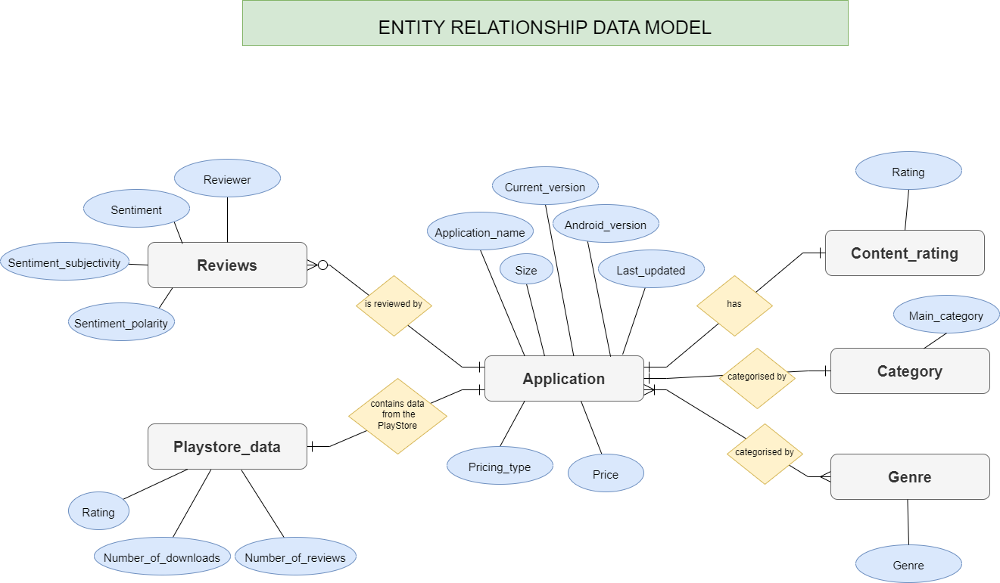
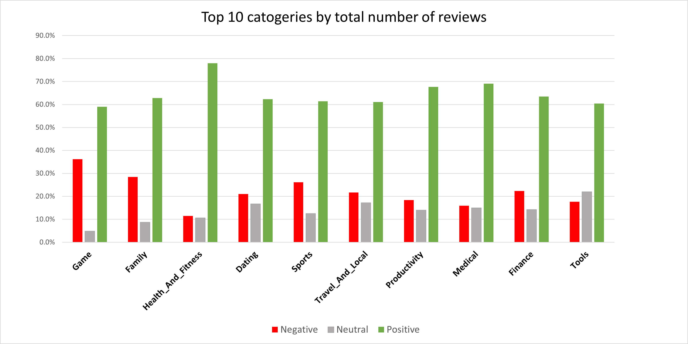

# Analysing mobile applications on the Google PlayStore

---

## Project Overview

This project serves to analyse the review sentiments on the available mobile applications on the Google PlayStore, to find out if the popularity of applications are affected by different types of factors. PostgreSQL will be used for data transformation and analysis.

Dataset source: [Kaggle](https://www.kaggle.com/datasets/lava18/google-play-store-apps?select=googleplaystore.csv&page=2)

## Objectives

- By analysing which applications have the best ratings and number of downloads, identify which applications people prefer and the factors that possibly have any influence.
- What are the sentiments of people for the current applications available?

## Data preparation

#### Entity relationship diagram

An ER diagram was created to show the relationship between the different entities.

- Step 1 - define all the entities
  - Application
  - Playstore_data
  - Category
    - Reviews
  - Content_rating
  - Genre
- Step 2 - Determine the attributes of each entity
- Step 3 - Determine the relationships between entities
  - Application - Category -> one to one
  - Application - Content_rating -> one to one
  - Application - Review -> one to many
  - Application - many to many
    - Application - Playstore_data - one to one

#### Database schema

Initially there were 2 tables based on the dataset as shown:

The tables were then normalised to the 3rd normal form. The resulting database schema is as shown:

#### Data cleaning

The data was first converted from .csv to .sql file format using sqlite3, and loaded into Postgresql by running the .sql scripts. Click [here]() to access the .sql files.

The following steps were then carried out to clean the data and create tables according to the database schema. You can view the queries [here.](datapreparation.sql)

- Create relevant tables according to the database schema
  ○ Copy values from original 2 tables
  ○ Delete any duplicates from "App" column
  ○ Add primary keys and foreign keys to connect the tables
  ○ Rename columns if necessary
- Do some cleaning to transform the data to fit constraints
  ○ Change the date format
  ○ Remove '$' symbol from price column in application table
- Add constraints to the columns

## Analysis

To determine the best type of application, it will be based on 4 variables: Number of apps, number of reviews, rating, and number of downloads. There will be 2 factors in consideration for the type the application: category and pricing type. All the SQL queries can be viewed [here.](analysis.sql)

The chart below shows the top 10 categories by total number of reviews. It splits the review sentiment by positive, negative and neutral.

## Conclusion

- Based on the 4 variables: Number of apps, number of reviews, rating, and number of downloads. I have narrowed down to 3 categories: Medical, Parenting, health and fitness. They have good ratings, and number of downloads, and have a relatively low competition due to few apps available. If we include review sentiment, health and fitness would be the number 1 choice.
- Free apps are generally more well received and in demand by people.

**Limitations**

- It cannot be determined however, whether free apps bring in more revenue as there are no other data available, such as ad revenue, subscriptions.
