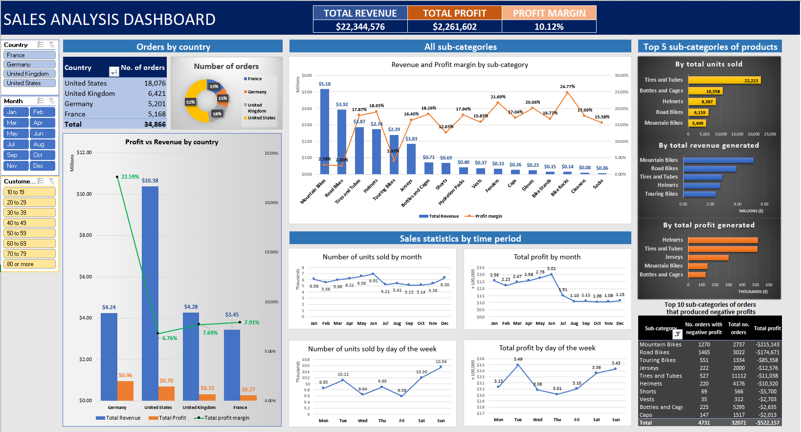

# Sales analysis using Excel

---

## Project Overview

- Analysing past sales over time period of 2 years for a company that sells bicycles and accessories which operates in the Unites States
- Company also does international shipping to United Kingdom, France and Germany
- Analysing the sales performance of different product categories to identify which categories are profitable and whether international shipping is good for the company
- Data is analysed using Microsoft Excel

## Objectives

##### Business objectives

- To analyse which categories of products have the best sales performance and how they are affected by country, month and customer age
- Identify which products are more popular and should be prioritised in terms of time and resources
- Identify which products are bringing in the most profit and which are not

##### Questions to guide the analysis

- Which country brings in the highest profit/revenue?
- Which product category has highest profit?
- Which product category has the highest quantity of sales?
- Which periods bring in the most sales in terms of quantity and profit?

## Preparation of data

##### Overview on the dataset

- Dataset contains information on product categories, as well as the revenue, profit, total cost and units sold for each order
- Information on demographics of customer such as age, country where the order came from and gender are also provided
- Contains 16 columns and almost 35,000 rows of data
- The original data is from kaggle at this [link.](https://www.kaggle.com/datasets/thedevastator/analyzing-customer-spending-habits-to-improve-sa) Credit goes to Vineet Bahl for providing the data
- Raw data can be viewed by clicking on this [link](https://github.com/benjamin-mak/Data-analysis-projects/tree/main/Sales%20analysis%20using%20Excel/Files) and downloading `Raw_data.csv`

The image below shows a snapshot of the raw data:

The data was extracted from a .csv file using Powerquery where some cleaning was done, and then loaded into Excel.

These were the steps for data cleaning:

- Removed blank column 'Column1'
- Added 'Profit' column using [Revenue] - [Cost]
- Formatted all values in 'Date' column from text to UK date format, as it consisted of a combination of US and UK date formats
- Removed blank rows from 'Date' column
- Created new column: 'Day of the week'
- Extracted month from 'Date' column
- Added 'Profit margin' column using [Profit] / [Revenue]

**Columns description**
| Column Name | Description (Data type) |
| ----------- | ----------- |
| Index | Order number |
| Date | Date of sale. (Date) |
| Day of week | Day of the week of the sale (String)
| Year | Year of the sale. (Integer)
| Month | Month of the sale. (Integer)
| Customer Age |Age of the customer. (Integer)
| Customer Gender | Gender of the customer. (String)
| Country | Country of the customer/ where order was placed. (String)
| State | State of the customer. (String)
| Product Category | Category of the product. (String)
| Sub Category | Sub-category of the product. (String)
| Quantity | Quantity of the product sold/purchased. (Integer)
| Unit Cost | Cost of the product per unit. (Float)
| Unit Price | Price of the product per unit. (Float)
| Cost | Total cost from the sale
| Revenue | Total revenue generated from the sale. (Float)
| Profit | Total profit generated from the sale (Float)
| Profit Margin | Profit as a percentage of the revenue (Float)

The image below shows a snapshot of the cleaned data:

## Data analysis and findings

Analysis was done in Excel using Pivot tables and Pivot charts. Here are some of the findings:

**1. Analysing profit margin by country**

- Total orders from Germany had the highest profit and profit margin at $958,825 and 22.6% respectively
- Although orders from USA had the highest revenue and second highest total profit, it had the lowest profit margin
- Split of total number of orders from each respective country is: USA - 52%; UK - 18%; Germany - 15%; France - 15%

**2. Sales by product category**

- Highest profit - Helmets
- Highest revenue - Mountain bikes
- Highest number of units sold - Tires and tubes

- There is a high demand from customers for mountain and road bikes as seen from the revenue and number of units sold. However, it is not that profitable to the business as the profit margin is low
- Tires and tubes and helmets are better for the business due to its high profit margin and still relatively high demand by customers

**3. Total sales by month and day of the week**

- In terms of units sold
  - Weekends have the highest number of units sold
  - June and May have the highest number of units sold

- In terms of profit
  - Customers tend to spend the most on Tuesdays followed by on weekends
  - Customer tend to spend more during the first half of the year until a peak at June

## Dashboard

An interactive dashboard was created showing the sales by categories. Additionally there are filters to filter the dashboard by country, month and customer age for further analysis.
The dashboard can be accessed from this [link](https://github.com/benjamin-mak/Data-analysis-projects/tree/main/Sales%20analysis%20using%20Excel/Files) and downloading `Sales analysis report.xlsx`.

## Conclusion and recommendations

- Tires and tubes, helmets have the best ROI with a high revenue and profit margin. Resources should be focused more on these products in terms on logistics as well as marketing, as they are good for the company and there is demand from customers
- All bikes sold during this period are not profitable for the company even though the revenue is high. Either the cost of the bikes needs to be looked into or the selling price has to be controlled. If there was a promotion to attract customers, it is effective but is not sustainable in the long term for the company
- Orders from Germany have the highest profit margin, the company should continue to focus on this pool of customers, find ways to attract new customers and increase the number of orders. Should also look into reasons why customers from Germany are willing to pay higher prices.
- Orders within the United States have the lowest profit margin. The is a good demand for bikes as seen from the revenue and quantity sold, but it will not be profitable for the company in the long run hence the reasons why many bikes were sold at a loss should be reviewed.
- May and June seem to be the months where customers buy and spend the most amount of money. The first half of the year also brings in more revenue as compared to the second half. Marketing should focus on this period.
- For days of the week, customers are generally spending more and placing orders on weekends with the exception of orders from France.
